# SwiftLoan Onboarding & Application Flow

This document outlines the complete, step-by-step onboarding and application flow of the SwiftLoan app. You can use this blueprint to build the user onboarding journey for other mobile applications (e.g., using React Native, Flutter, Swift, or Kotlin).

---

## 🗺️ Visual Flowchart (Mermaid)

```mermaid
graph TD
    %% Phase 1: Authentication & Account Setup
    subgraph Phase 1: Authentication & Security
        A[1. Language Selection] --> B[2. Mobile Verification]
        B -->|Send & Verify OTP| C[3. Email Verification]
        C -->|Google or Manual Email| D[4. Security PIN Setup]
        D -->|Create & Confirm 4-Digit PIN| E[5. Biometrics Setup]
        E -->|Fingerprint / FaceID / Skip| F[6. App Permissions]
    end

    %% Phase 2: Identity & KYC Verification
    subgraph Phase 2: KYC & Identity
        F --> G[7. Terms & Consents]
        G -->|Accept T&C & Bureau Checks| H[8. PAN Verification]
        H -->|Auto-fetches Credit Name| I[9. Aadhaar Verification]
        I -->|OTP or DigiLocker| J[10. Selfie Capture]
        J -->|Liveness Check / Photo Capture| K[11. Personal Details]
        K -->|Name, DOB, Gender, Marital Status| L[12. Address Details]
    end

    %% Phase 3: Financial Profiling & Offers
    subgraph Phase 3: Financials & Finalization
        L --> M[13. Employment Details]
        M -->|Company, Designation, Exp| N[14. Income Details]
        N -->|Monthly / Annual Sliders| O[15. Bank Account Verification]
        O -->|UPI / Account details + ₹1 deposit| P{16. Eligibility Engine}
        P -->|Checking 100+ Data Points| Q[17. Congrats / Loan Offer]
        Q -->|Select Tenure & EMI| R[18. Loan Summary & Agreement]
        R -->|Aadhaar eSign / OTP| S[19. Success / Completion]
    end

    style A fill:#dbeafe,stroke:#2563eb,stroke-width:2px
    style G fill:#ccfbf1,stroke:#0d9488,stroke-width:2px
    style M fill:#fef3c7,stroke:#f59e0b,stroke-width:2px
    style S fill:#dcfce7,stroke:#22c55e,stroke-width:2px
```

---

## 🔑 Phase 1: Authentication & Security Setup

This phase sets up the basic user profile, verifies contact details, and establishes device-level security.

### 1. Select Language
*   **Purpose**: Localize the experience immediately to reduce bounce rates.
*   **UI/UX**: Simple vertical list of cards with radio checkmark indicators.
*   **Fields**:
    *   `Language` (Options: English, Hindi, Marathi, Tamil, Telugu).
*   **Action**: Clicking a language immediately selects it.

### 2. Mobile Verification
*   **Purpose**: Register/identify the user and prevent bot access.
*   **UI/UX**: Single text-field with country code prefix, followed by a 6-digit OTP grid once sent.
*   **Fields**:
    *   `Mobile Number` (10 digits, numeric only).
    *   `OTP` (6 individual input boxes with auto-focus shifting).
*   **Actions**:
    *   `Send OTP`: Validates length and requests code.
    *   `Verify OTP`: Checks code validity.
    *   `Resend OTP`: Becomes active after a 30-second cooldown timer.

### 3. Email Verification
*   **Purpose**: Establish a secondary contact method and secure password recovery.
*   **UI/UX**: Toggle buttons for quick login vs manual input.
*   **Fields / Buttons**:
    *   `Continue with Google` (OAuth 2.0).
    *   `Continue with Email` (Manual text entry field).
    *   `Email Address` (Format checked: `string@domain.com`).

### 4. Create Security PIN
*   **Purpose**: Allow fast authentication on subsequent app opens without entering passwords.
*   **UI/UX**: Obfuscated numeric keyboard inputs.
*   **Fields**:
    *   `Create PIN` (4 digits, numeric).
    *   `Confirm PIN` (4 digits, numeric).
*   **Validation**: Must match. Should throw an error if the combination is too sequential (e.g., `1234`) or repeating (e.g., `1111`).

### 5. Biometric Setup
*   **Purpose**: Enable fingerprint/FaceID hardware unlocking.
*   **UI/UX**: Side-by-side selection blocks (Fingerprint / Face ID) with an option to skip.
*   **Actions**:
    *   `Enable Now`: Invokes native OS biometric APIs (Touch ID / Face ID / Android BiometricPrompt).
    *   `Skip For Now`: Bypasses to the next step.

### 6. App Permissions
*   **Purpose**: Get device data necessary for risk calculations, notifications, and branch location.
*   **UI/UX**: Standard native permission explanation cards with toggles.
*   **Toggles**:
    *   `SMS Access`: Used to auto-read OTPs and analyze financial transaction histories (key for thin-file credit profiles).
    *   `Location Access`: Used to match the current IP/GPS with address proofs and locate ATMs.
    *   `Notification Access`: Used to deliver loan status updates and payment reminders.

---

## 📝 Phase 2: KYC & Identity Verification

This phase collects regulatory information (KYC) to establish the legal identity of the user.

### 7. Consents & Authorizations
*   **Purpose**: Legally allow the app to query bureaus (e.g., CIBIL, Experian) and Central KYC (CKYC).
*   **UI/UX**: List of checklist boxes. All must be checked to continue.
*   **Consents Required**:
    *   Terms & Conditions agreement.
    *   Privacy Policy agreement.
    *   Credit Bureau Check authorization.
    *   CKYC registry retrieval permission.
    *   SMS, Email, and WhatsApp communication channel consent.

### 8. PAN Verification
*   **Purpose**: Retrieve tax and bureau credit history.
*   **UI/UX**: Uppercased input card with automatic capital letters.
*   **Fields**:
    *   `PAN Number` (10-digit alphanumeric, formatted as `AAAAA0000A`).
*   **Action**: Clicking `Verify PAN` fetches the associated legal name from the NSDL/Bureau database (e.g., *"Rahul Sharma"*) for the user to confirm.

### 9. Aadhaar Verification
*   **Purpose**: Verify the government address and identity registry.
*   **UI/UX**: Selector for verification method.
*   **Methods**:
    *   `Aadhaar OTP`: User enters 12-digit Aadhaar number -> gets UIDAI OTP on linked mobile.
    *   `DigiLocker Integration`: Redirects to DigiLocker OAuth page for instant digital document pull.

### 10. Selfie Verification
*   **Purpose**: Fraud prevention (liveness checks) to ensure the user is present and matches the documents.
*   **UI/UX**: Interactive circular camera viewport.
*   **Liveness Check Instructions**: "Fit your face in the oval," "Blink to capture."
*   **Actions**:
    *   `Capture`: Snaps the image.
    *   `Retake`: Clears the captured image.
    *   `Submit`: Uploads and compares with PAN/Aadhaar photos using facial recognition APIs.

### 11. Personal Details
*   **Purpose**: Gather additional personal metadata not included in official identities.
*   **UI/UX**: Dropdowns and segmented button controls.
*   **Fields**:
    *   `Full Name` (Auto-filled from PAN/Aadhaar, editable/confirmable).
    *   `Date of Birth` (Auto-filled, formatted as YYYY-MM-DD).
    *   `Gender` (Male, Female, Other).
    *   `Marital Status` (Single, Married, Divorced).

### 12. Address Details
*   **Purpose**: Confirm housing stability and verify dispatch address.
*   **UI/UX**: Textareas with a quick toggle for mirroring Aadhaar address.
*   **Fields**:
    *   `Current Address` (Textarea).
    *   `Same as Aadhaar` (Checkbox toggle).
    *   `Permanent Address` (Textarea, hidden if matched above).
    *   `Pincode` (6-digit numeric).
    *   `City` (Text).
    *   `State` (Text).

---

## 💼 Phase 3: Financial Profile & Offers

In this phase, we analyze the user's repayment capability and calculate the custom loan offer.

### 13. Employment Details
*   **Purpose**: Understand the stability and origin of the user's income.
*   **UI/UX**: Grid selectors and text inputs.
*   **Fields**:
    *   `Employment Type` (Salaried, Self Employed, Freelancer, Business Owner, Student).
    *   `Company Name` (Autocomplete input field).
    *   `Designation` (Text field).
    *   `Total Experience` (Numeric field, in years).

### 14. Income Details
*   **Purpose**: Set maximum debt-to-income limits.
*   **UI/UX**: Interactive slider combined with numeric inputs.
*   **Fields**:
    *   `Monthly Net Take-Home Salary` (Slider, range: ₹10,000 - ₹500,000).
    *   `Annual Income` (Auto-calculated as `Monthly Income * 12`).

### 15. Bank Account Verification
*   **Purpose**: Link the disbursement destination and secure the repayment setup.
*   **UI/UX**: Segmented options (UPI / NetBanking / Account Number input).
*   **Fields**:
    *   `Account Holder Name` (Should match verified PAN/Aadhaar).
    *   `Account Number` (Numeric).
    *   `IFSC Code` (11-digit alphanumeric, auto-populates Bank Name and Branch).
    *   `Bank Name` (Read-only/auto-fetched).
*   **Action**: Penny-Drop Verification (system transfers ₹1.00 to the account to confirm active status and name validation).

### 16. Eligibility Engine (Loading State)
*   **Purpose**: Call backend microservices, credit bureau API check, and risk scorecard.
*   **UI/UX**: Clean spinner page with reassuring copy like *"Analyzing your profile against 100+ data points"*. Includes a simulated progress bar to keep user engaged.

---

## 📈 Phase 4: Finalization & Disbursement

The user configures their loan details, signs the contract, and completes the flow.

### 17. Loan Offer Selection
*   **Purpose**: Present the customized loan configurations available to the user.
*   **UI/UX**: Premium dark theme card with sliding inputs for tenure and loan size.
*   **Dynamic Calculations**:
    *   `Approved Amount` (Maximum available limit).
    *   `Interest Rate` (e.g., 12% p.a.).
    *   `Select Tenure` (Pills/buttons for 12, 24, 36, 48, 60 months).
    *   `Monthly EMI` (Auto-calculated: $\text{EMI} = \frac{P \cdot r \cdot (1+r)^n}{(1+r)^n - 1}$).

### 18. Loan Summary & Agreement Check
*   **Purpose**: Final check of fees and terms before entering a legal agreement.
*   **UI/UX**: Structured list of charges, followed by agreement acceptance.
*   **Displayed Items**:
    *   Disbursal Amount vs Loan Amount.
    *   Processing Fees (e.g., 2% + GST).
    *   Total Repayment (Interest + Principal).
*   **Agreement Link**: Clicking opens PDF document containing the terms.
*   **Checkbox**: *"I agree to the Loan Agreement and terms."*

### 19. eSign & Success
*   **Purpose**: Legal execution of the digital contract.
*   **UI/UX**: Signature pad interface or Aadhaar eSign redirect.
*   **Execution**:
    *   Aadhaar eSign (Redirects to NSDL/CDAC page for Aadhaar OTP).
    *   Success Screen: Shows application summary, dynamic Transaction ID, and instructions on next steps.

---

## 📱 Mobile Implementation Recommendations

When migrating this flow to a mobile app framework (like React Native or Flutter), make sure to leverage native hardware features:

| Screen / Step | Native Mobile Optimization | Suggested Libraries / APIs |
| :--- | :--- | :--- |
| **Mobile OTP** | Auto-fill OTP from SMS directly into code cells. | **React Native**: `@twilio-labs/react-native-otp-input` **Android**: `SmsRetriever API` |
| **PIN Setup** | Store PIN safely in secure enclaves (Keychain/Keystore). | **React Native**: `react-native-keychain` **Flutter**: `flutter_secure_storage` |
| **Biometrics** | Prompt face/fingerprint authentication on launch. | **React Native**: `react-native-fingerprint-scanner` or `expo-local-authentication` **Flutter**: `local_auth` |
| **Selfie Verification**| Access camera frame with auto face detection bounds. | **React Native**: `react-native-vision-camera` **Flutter**: `camera` package with MLKit Face Detection |
| **Permissions** | Pre-explain why permissions are required *before* showing native OS dialogs (Increases opt-in rate). | **React Native**: `react-native-permissions` **Flutter**: `permission_handler` |
| **State Management** | Use state machines to handle wizard logic and block screens if prior steps fail. | **React Native / Flutter**: Use Redux Toolkit, Zustand, or Bloc. |